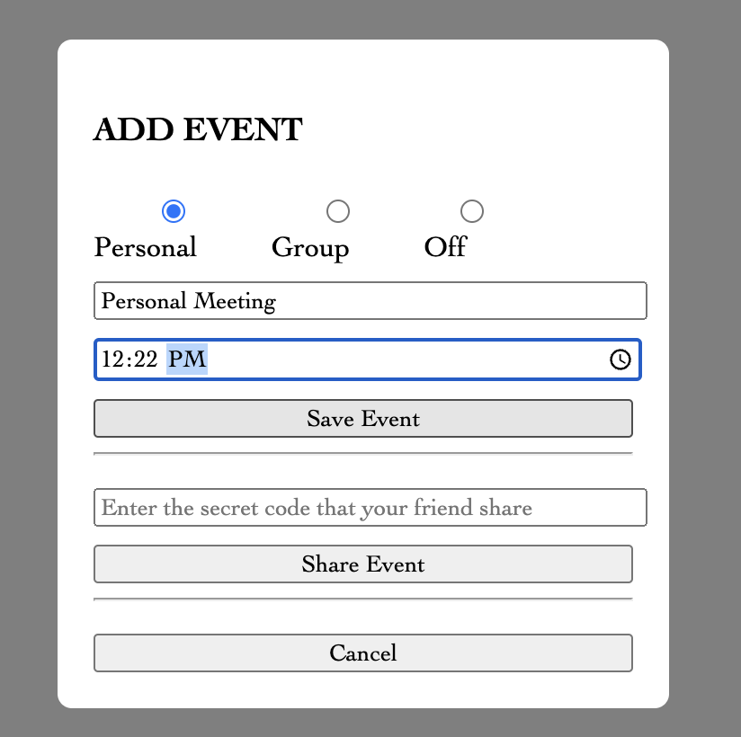
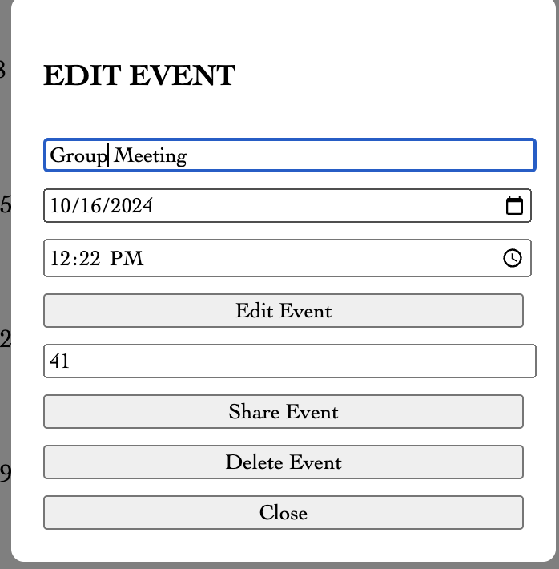
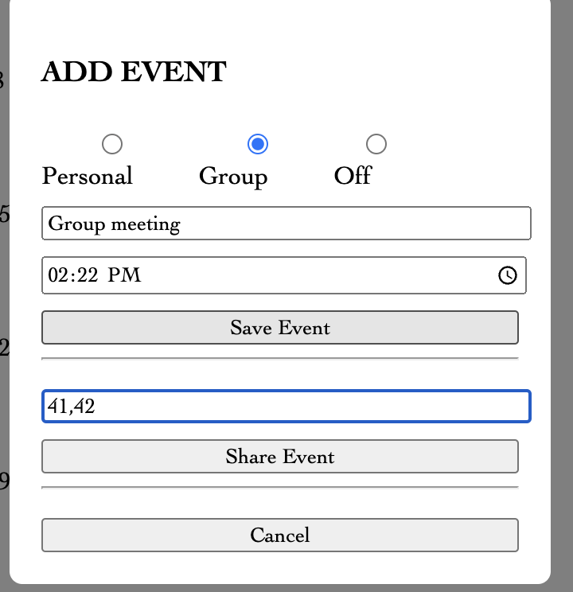

Author: Yiding Chen

Example Calendar URL: http://ec2-3-134-107-227.us-east-2.compute.amazonaws.com/~catrigger/cse503/M5/login.html

Table structures : User & Event
Inside the Table structure Folder.

Usage:
click - and + button to move around time
AddEvent: click an date to add title and time to it then click the save event button
deleteEvent: click on the event you want to delete, click the delete button to delete it
editEvent: click on the event you want to edit, change anything you want, then click the edit button to edit it

###Warning: In some public internets do not hit the refresh button when testing, or you will lose the csrf token which not allow you to do any of the operation. You have to log in again.
 

Sample Login ID and Password & Secret Key

ID: 000 Pass: 111 Secret Key: 12
ID: kim Pass: jim Secret Key: 13 
ID: andrew Pass: oh Secret Key: 4
Suggested account: 000. it has some testing events stored in it.

1. User can use tag an event with a 3 particular section: group, personal, and off

- This meant to be schedule on the calendar that you are actually in group meeting for specific day & personal metting & the day off time to manage your time wisely. It will shows as the red tag on the left on the specific date that you choose. 

2. User can share their calendar with additional users.

- This is meant literally to sharing their events to other people on the calander. You can either share in the begining of making events and also in the step of editing. Since you want to share with the specific person that you want so we have created the section called "Enter the secret code that you friend share". There is the secret key with the ID and password to test in the begining of ReadMe. 

3. User can create group events. 

- Only in the Add Event section(after clicking the date), you can create the group events basically like you share with one person. The difference in here is that you can add much as Users that you want. ex : 41,42....

#Free to edit.